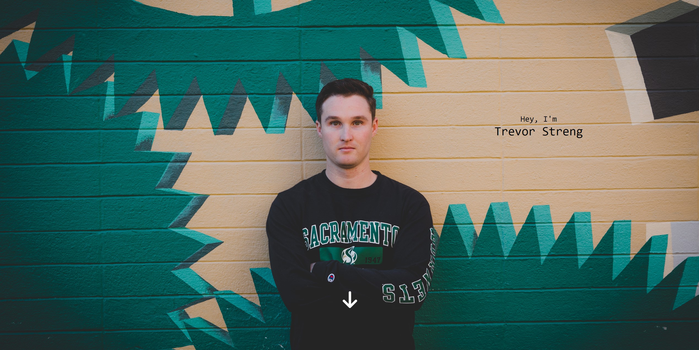
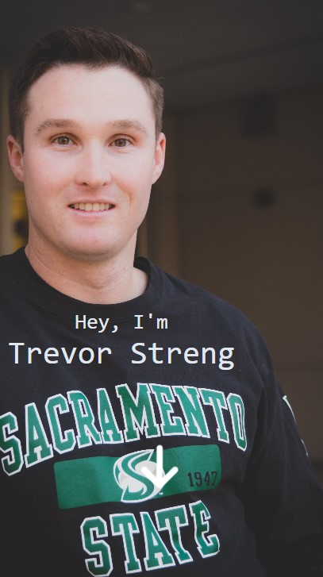

# Trevor Streng Landing Page

[Trevorstreng.com](https://www.trevorstreng.com/) is built using Next.js and hosted on Vercel.

<!--   -->
<div style="display: flex;">
    <!-- 
     -->
    
    
</div>

This website is a simple one page design. It displays a picture of me at the top followed by multiple sections including About Me, Skills, Education, Work History and Projects.

This project is open source to allow others to use this design for their own website.

Built to be responsive for mobile devices and displays a different picture that better fits smaller screen sizes.

## Requirements

This project is written using the Next.Js framework which requires Node.js to run locally.

## Install and Setup

```
git clone https://github.com/TrevorStreng/landing-page.git
npm i
npm run dev
```

## Run a Production build

```
npm run build
```

## Need Help

Connect with me on [LinkedIn](https://www.linkedin.com/in/trevor-streng/)
